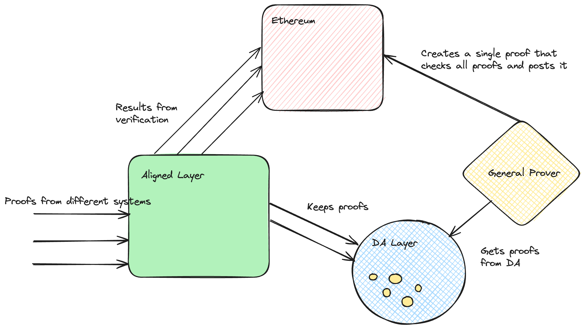

# How does Aligned Layer work?

The core elements are:

- Aligned Layer: It receives proofs from different proof systems, verifies them, sends the final result to Ethereum, and posts the data into a DA layer.
- Data Availability Layer (DA): provides storage for the different proofs
- General Prover/Verifier: Every several days, takes the proofs from the DA layer and generates a proof of the verification of all the proofs. The general prover can be based on the SP1 virtual machine, which is a virtual machine able to prove general rust code. The proof of the verification of the proofs is done using the corresponding verifier codes in Rust. The verification can be done using a tree structure.
- Ethereum

## Interaction between the main components:

## Prover and recursion tree

Aligned Layer receives several proofs from different sources, which could be generated using different proof systems. These have varying proof sizes, verification times, and different verification logic. However, all proofs share a common characteristic: their verification is fast. Aligned Layer has dedicated verifiers, which can be used to check the validity of each of them and post the results to Ethereum. It offers two advantages over Ethereum: cheaper verification costs and can be easily updated to include a new verifier to check proofs from newer proof systems. //speak of soft finality and security guarantees

The proofs are stored in a Data Availability Layer, which offers a cost-efficient strategy for storage.

Ethereum receives the results of the verification from Aligned Layer. However, Ethereum itself does not have access to verify the proofs, since this would be too costly. Instead, a general Rust prover generates a proof of verification of all the proofs included in a given period of time. Even if this proof can be quite large, it is only one proof that attests to the validity of all proofs. No matter how complex the verifier is, it can be written in Rust and proven by a virtual machine. To aggregate all the proofs, in the first step, transform all proofs into proofs of execution of the virtual machine, achieving proof uniformity. We can then shrink proof size by recursively proving the verification of proofs, as shown in the tree diagram, for example.
